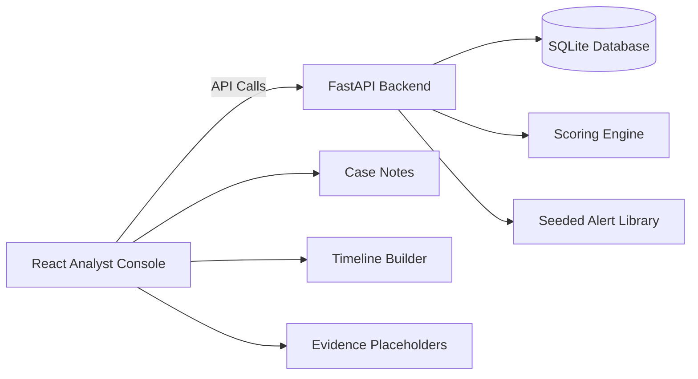
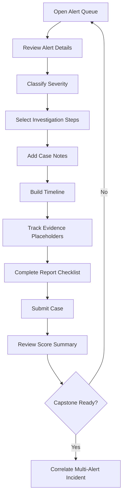
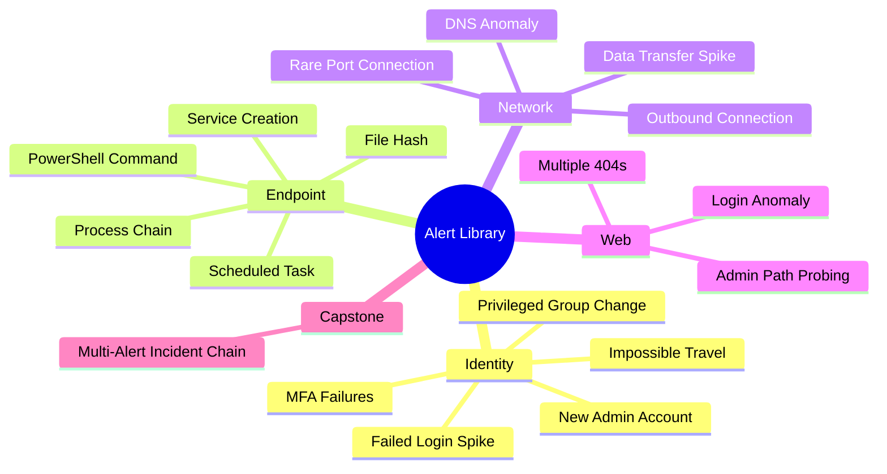
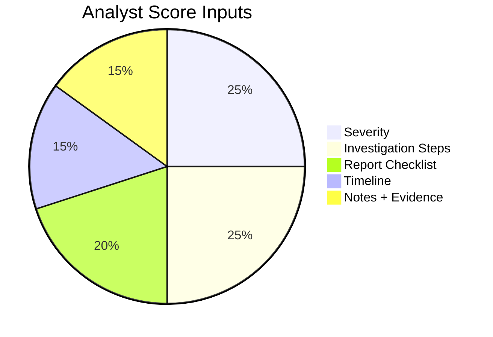

<div align="center">

# 🛡️ 02 · SOC Analyst Simulator

### A local, defensive cyber training lab for alert triage, investigation, timeline building, case notes, reporting, and analyst scoring.


<br />
<br />

[](#-tech-stack)
[](#-tech-stack)
[](#-tech-stack)
[](#-docker-compose-run)
[](#-powershell-helper-scripts)
[](#-authorized-training-only)

---

### `Repo #02` in the MacKinnonTech cyber defense lab series

**Alert Queue → Investigation → Evidence → Timeline → Report → Score → Capstone**

[Overview](#-project-purpose) •
[Features](#-feature-grid) •
[Install](#-installation) •
[Workflow](#-analyst-workflow) •
[Alerts](#-prebuilt-alert-library) •
[Scoring](#-scoring-engine) •
[Docs](#-included-docs) •
[Badges](#-completion-badges) •
[Safety](#-authorized-training-only)

</div>

---

## 🧭 Project Purpose

`02-soc-analyst-simulator` is a **fully local SOC analyst training simulator** designed to teach realistic blue-team habits without touching real systems.

The simulator gives new and intermediate analysts a safe environment to practice:

<table>
<tr>
<td width="33%">

### 🎯 Triage
Prioritize alerts, classify severity, and decide what deserves immediate attention.

</td>
<td width="33%">

### 🔎 Investigation
Review simulated identity, endpoint, web, and network telemetry.

</td>
<td width="33%">

### 📝 Reporting
Build notes, timelines, evidence references, and final incident summaries.

</td>
</tr>
</table>

This project is built for **legal, authorized, local lab training only**. All alerts, users, endpoints, telemetry, file hashes, evidence names, and cases are simulated.

---

## 📸 Screenshots Placeholder

> Add your screenshots after first launch. Keep these filenames so the README stays clean.

| Screen | Preview Slot | Path |
|---|---:|---|
| Alert Queue | 🧾 Queue overview | `assets/screenshots/alert-queue.png` |
| Alert Detail | 🔎 Investigation panel | `assets/screenshots/alert-detail.png` |
| Case Notes | 📝 Notes workspace | `assets/screenshots/case-notes.png` |
| Timeline Builder | 🧭 Incident sequence | `assets/screenshots/timeline-builder.png` |
| Scoring Summary | 🏆 Analyst score | `assets/screenshots/scoring-summary.png` |
| Capstone Case | 🚨 Multi-alert incident | `assets/screenshots/capstone-case.png` |

```text
assets/
└── screenshots/
    ├── alert-queue.png
    ├── alert-detail.png
    ├── case-notes.png
    ├── timeline-builder.png
    ├── scoring-summary.png
    └── capstone-case.png
```

---

## ⚙️ Tech Stack

| Layer | Technology | Purpose |
|---|---|---|
| Frontend | **React + Vite** | Interactive analyst console |
| Backend | **Python FastAPI** | API, case logic, scoring routes |
| Database | **SQLite** | Local seeded alerts and case history |
| Containers | **Docker Compose** | One-command local lab launch |
| Scripts | **PowerShell** | Windows-friendly run/reset/push helpers |
| Docs | **Markdown** | SOC workflow and capstone training material |



---

## ✨ Feature Grid

| Capability | Included | Training Value |
|---|:---:|---|
| Alert queue | ✅ | Practice prioritizing incoming SOC work |
| Severity levels | ✅ | Learn impact-based classification |
| Simulated endpoints | ✅ | Build endpoint investigation habits |
| Simulated users | ✅ | Review identity-driven cases |
| Case notes | ✅ | Capture clear analyst reasoning |
| Timeline builder | ✅ | Reconstruct incident sequence |
| Evidence attachment placeholder | ✅ | Track artifacts without real sensitive files |
| Analyst scoring system | ✅ | Receive feedback on decisions |
| Completed case history | ✅ | Review progress over time |
| Final capstone case | ✅ | Correlate multiple alerts into one incident |
| Docker Compose | ✅ | Run the lab locally with one command |
| PowerShell helpers | ✅ | Windows-friendly project operation |

---

## 📦 Installation

### Requirements

| Tool | Recommended Version | Check Command |
|---|---:|---|
| Git | Current | `git --version` |
| Docker Desktop | Current | `docker --version` |
| Node.js | 18+ | `node --version` |
| Python | 3.11+ | `python --version` |
| PowerShell | 5.1+ / 7+ | `$PSVersionTable.PSVersion` |

---

## 🐳 Docker Compose Run

From PowerShell:

```powershell
cd "E:\CyberLab\GitHub Repos\02-soc-analyst-simulator"
docker compose up --build
```

Open:

| Service | URL |
|---|---|
| Analyst Console | `http://localhost:5173` |
| Backend API Docs | `http://localhost:8000/docs` |

Stop the lab:

```powershell
docker compose down
```

---

## 🧪 Local Developer Run

### Backend Terminal

```powershell
cd "E:\CyberLab\GitHub Repos\02-soc-analyst-simulator\backend"
python -m venv .venv
.\.venv\Scripts\Activate.ps1
pip install -r requirements.txt
uvicorn app.main:app --reload --host 0.0.0.0 --port 8000
```

### Frontend Terminal

```powershell
cd "E:\CyberLab\GitHub Repos\02-soc-analyst-simulator\frontend"
npm install
npm run dev
```

Open:

```text
http://localhost:5173
```

---

## ⚡ PowerShell Helper Scripts

| Script | Purpose |
|---|---|
| `scripts/run-local.ps1` | Start the local app workflow |
| `scripts/reset-db.ps1` | Reset/reseed the simulator database |
| `scripts/github-push.ps1` | Push the repo to GitHub |

Run helper:

```powershell
cd "E:\CyberLab\GitHub Repos\02-soc-analyst-simulator"
.\scripts\run-local.ps1
```

---

## 🧠 Skills Learned

<table>
<tr>
<td width="50%">

### SOC Fundamentals
- Alert triage
- Case prioritization
- Severity classification
- Analyst note writing
- Report quality control

</td>
<td width="50%">

### Investigation Practice
- Identity anomaly review
- Endpoint process review
- Web activity review
- Network anomaly review
- Incident timeline construction

</td>
</tr>
<tr>
<td width="50%">

### Defensive Thinking
- Impact analysis
- Confidence scoring
- Containment recommendations
- Evidence handling habits
- Case closure discipline

</td>
<td width="50%">

### Professional Output
- Executive summaries
- Technical findings
- Remediation notes
- Lessons learned
- Final score review

</td>
</tr>
</table>

---

## 🧭 Analyst Workflow



### Core workflow

1. **Open the alert queue** and sort by severity, time, or category.
2. **Review alert details** including user, endpoint, source, and summary.
3. **Select severity** based on business impact and evidence confidence.
4. **Choose investigation steps** that match the alert type.
5. **Add case notes** explaining what was reviewed and why it matters.
6. **Build a timeline** using simulated event timestamps.
7. **Attach evidence placeholders** by recording artifact names.
8. **Complete the report checklist** with clear findings and recommendations.
9. **Submit for scoring** and review missed items.
10. **Complete the capstone** by connecting multiple alerts into one incident.

---

## 🚨 Prebuilt Alert Library

The simulator includes **25 seeded alerts** covering identity, endpoint, network, and web activity.

| # | Alert Type | Category | Training Focus |
|---:|---|---|---|
| 01 | Failed login spike | Identity | Brute-force pattern recognition |
| 02 | Impossible travel | Identity | Geo/time anomaly review |
| 03 | Suspicious PowerShell command | Endpoint | Command-line investigation |
| 04 | Abnormal outbound connection | Network | Beaconing-style pattern review |
| 05 | New admin account | Identity | Privilege change review |
| 06 | Suspicious file hash | Endpoint | File reputation workflow |
| 07 | Multiple 404 requests | Web | Web scanning noise vs risk |
| 08 | Web login anomaly | Web | Authentication pattern review |
| 09 | Data transfer spike | Network | Exfiltration concern triage |
| 10 | Endpoint isolation recommendation | Endpoint | Containment decision-making |
| 11 | Repeated MFA failures | Identity | Account security review |
| 12 | Unusual service creation | Endpoint | Persistence indicator review |
| 13 | Rare parent-child process chain | Endpoint | Process tree reasoning |
| 14 | DNS request anomaly | Network | Suspicious destination review |
| 15 | Privileged group membership change | Identity | Access control review |
| 16 | External sharing spike | Data | Data exposure triage |
| 17 | Suspicious archive creation | Endpoint | Collection behavior review |
| 18 | VPN login from new country | Identity | Remote access anomaly review |
| 19 | Unusual scheduled task | Endpoint | Persistence workflow review |
| 20 | Web admin path probing | Web | Reconnaissance triage |
| 21 | High-risk endpoint alert cluster | Endpoint | Multi-signal prioritization |
| 22 | Sensitive file access burst | Data | Insider-risk style review |
| 23 | Command shell from office app | Endpoint | Suspicious execution chain review |
| 24 | Rare outbound port connection | Network | Egress anomaly triage |
| 25 | Capstone incident connector alert | Multi-domain | Correlation and reporting |

<details>
<summary><strong>View alert family coverage</strong></summary>



</details>

---

## 🧮 Scoring Engine

The scoring engine evaluates analyst decisions across multiple categories.

| Score Area | What It Checks | Example Analyst Habit |
|---|---|---|
| Severity selection | Did you choose the correct severity? | Match impact to urgency |
| Investigation steps | Did you select relevant steps? | Review identity, endpoint, web, or network artifacts |
| Notes quality | Did your notes explain the decision? | Write clear, defensible reasoning |
| Timeline quality | Did you sequence events properly? | Establish what happened first, next, and last |
| Evidence tracking | Did you record useful evidence placeholders? | Reference logs, hashes, usernames, hostnames |
| Report checklist | Did you complete the final report sections? | Include summary, impact, findings, and recommendations |



---

## 🧩 Final Capstone Case

The final capstone case is built around a connected simulated incident:

```text
INC-CAP-9001
```

The capstone requires the analyst to correlate multiple alerts instead of treating each alert as isolated noise.

| Phase | Simulated Signal | Analyst Goal |
|---:|---|---|
| 1 | Identity anomaly | Identify the account risk |
| 2 | Endpoint command activity | Review suspicious host behavior |
| 3 | Network outbound anomaly | Determine external communication concern |
| 4 | Data transfer spike | Assess potential business impact |
| 5 | Isolation recommendation | Decide containment priority |
| 6 | Final report | Document the incident clearly |

---

## 📚 Included Docs

| Document | Purpose |
|---|---|
| [`docs/soc-workflow.md`](docs/soc-workflow.md) | End-to-end SOC analyst workflow |
| [`docs/alert-triage.md`](docs/alert-triage.md) | How to review and prioritize alerts |
| [`docs/incident-severity.md`](docs/incident-severity.md) | Severity definitions and examples |
| [`docs/report-writing.md`](docs/report-writing.md) | How to write clean incident reports |
| [`docs/capstone.md`](docs/capstone.md) | Final multi-alert case instructions |

---

## 🏆 Completion Badges

Use these as README achievements, profile badges, or internal training milestones.

| Badge | Requirement | Status |
|---|---|---:|
| 🟢 Alert Queue Rookie | Complete 5 alerts | `Locked` |
| 🔵 Triage Operator | Complete 10 alerts with 70%+ score | `Locked` |
| 🟣 Severity Specialist | Correctly classify 10 severities | `Locked` |
| 🟠 Timeline Builder | Add timeline entries to 10 cases | `Locked` |
| 🟡 Evidence Handler | Attach evidence placeholders to 10 cases | `Locked` |
| 🔴 Incident Reporter | Complete 10 report checklists | `Locked` |
| ⚫ Capstone Analyst | Complete all `INC-CAP-9001` alerts | `Locked` |
| 👑 SOC Lead Ready | Average 85%+ across all completed cases | `Locked` |

<details>
<summary><strong>Badge display idea for future app upgrade</strong></summary>

```text
[ Rookie ] → [ Operator ] → [ Specialist ] → [ Reporter ] → [ Capstone Analyst ] → [ SOC Lead Ready ]
```

Future enhancement idea: store badge unlocks in SQLite and render them on the analyst dashboard.

</details>

---

## 🗂️ Project Structure

```text
02-soc-analyst-simulator/
├── backend/
│   ├── app/
│   │   ├── database.py
│   │   ├── main.py
│   │   ├── scoring.py
│   │   └── seed_data.py
│   ├── data/
│   ├── Dockerfile
│   └── requirements.txt
├── frontend/
│   ├── src/
│   │   ├── App.jsx
│   │   ├── main.jsx
│   │   └── styles.css
│   ├── Dockerfile
│   ├── index.html
│   └── package.json
├── docs/
│   ├── alert-triage.md
│   ├── capstone.md
│   ├── incident-severity.md
│   ├── report-writing.md
│   └── soc-workflow.md
├── scripts/
│   ├── github-push.ps1
│   ├── reset-db.ps1
│   └── run-local.ps1
├── assets/
│   └── screenshots/
├── reports/
│   └── final-incident-report-template.md
├── docker-compose.yml
├── PROJECT-CHECKLIST.md
└── README.md
```

---

## 🚀 GitHub Push

From PowerShell:

```powershell
cd "E:\CyberLab\GitHub Repos\02-soc-analyst-simulator"

git init
git add .
git commit -m "Initial commit: SOC analyst simulator"
git branch -M main
git remote add origin https://github.com/m4ckDev/02-soc-analyst-simulator.git
git push -u origin main
```

If the repo already exists:

```powershell
cd "E:\CyberLab\GitHub Repos\02-soc-analyst-simulator"

git status
git add .
git commit -m "Polish README visuals and training documentation"
git push
```

---

## 🧾 Training Completion Checklist

- [ ] Launch the simulator locally
- [ ] Review the alert queue
- [ ] Complete 5 beginner alerts
- [ ] Complete 10 total alerts
- [ ] Correctly classify severity on 10 alerts
- [ ] Add notes to 10 cases
- [ ] Add timeline entries to 10 cases
- [ ] Complete report checklist on 10 cases
- [ ] Complete `INC-CAP-9001`
- [ ] Save final incident report
- [ ] Capture screenshots for the README
- [ ] Push completed project to GitHub

---

## 🛡️ Authorized Training Only

This repository is for **authorized local lab training only**.

It contains:

- Simulated alerts
- Simulated users
- Simulated endpoints
- Simulated telemetry
- Placeholder evidence names
- Defensive workflows

It does **not** include:

- Real exploit code
- Malware
- Phishing kits
- Credential theft instructions
- Instructions to attack real systems
- Instructions to bypass security controls

Use this project to build analyst skill, defensive judgment, and professional reporting habits in a safe lab environment.

---

<div align="center">

## MacKinnonTech Cyber Defense Lab Series

**Repo 01:** Cyber Range Blue Team  
**Repo 02:** SOC Analyst Simulator

Train hard. Document clearly. Defend legally.

</div>
